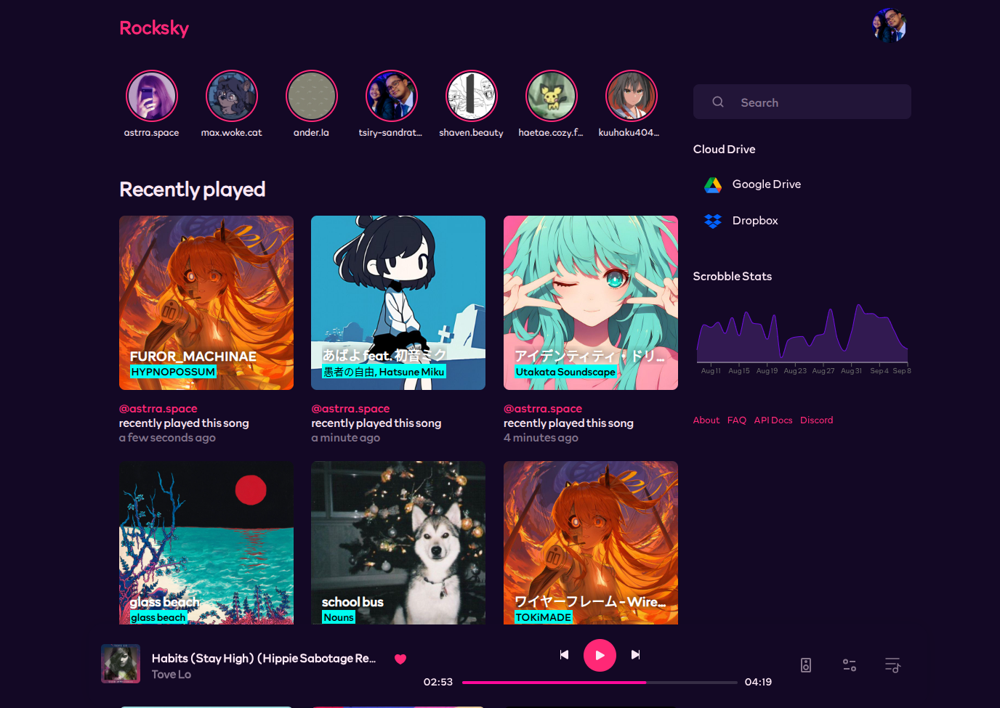

# Rocksky

[](https://github.com/tsirysndr/rocksky/actions/workflows/ci.yml)
[](https://discord.gg/EVcBy2fVa3)

A decentralized music tracking and discovery platform built on the AT Protocol 🎵 , see [Rocksky](https://rocksky.app).



## ✨ Features

### 🎵 Scrobbling APIs
- **Last.fm Compatible API** – drop-in replacement for Last.fm scrobblers
- **ListenBrainz Compatible API** – works with clients that support ListenBrainz

### 🕒 Playback & History

- **Recently Played Timeline** – browse your listening history
- **Stories View** – see what other users are playing in real time
- **Stats** – visualize scrobbles per day

### 📊 User Insights

- **Top Artists, Tracks, and Albums** – personalized charts of your listening habits
- **Shoutbox & Likes** – interact with other listeners and share reactions

### 🌐 Client Integrations
- **Spotify** – detect now playing tracks and scrobble directly from Spotify
- **Jellyfin** – track plays from your media server
- **Pano Scrobbler** – Android/Linux/Windows support
- **WebScrobbler** – scrobble directly from your browser

### 🔍 Search
- **Search Engine** – fast search powered by MeiliSearch

## 🚧 Coming Soon / Roadmap
- **Webhooks** - subscribe to scrobble events and integrate with Discord or your own apps
- **Personalized Feeds** – discover music through community-driven feed algorithms
- **Last.fm → Rocksky** Mirroring (Future Scrobbles) – automatically mirror new scrobbles from Last.fm into Rocksky
- **Rocksky Connect** – remote playback across devices (similar to Spotify Connect)
- **Multi-Source Libraries** – browse and scrobble from Google Drive, Dropbox, S3, FTP, and more
- **Stream & Scrobble Your Own Music** – upload your library and play directly on Rocksky
- **Extensions** – customize and extend Rocksky with your own logic
- **Crossfade & Equalizer Settings Sync** – carry your playback preferences across devices

## 📦 Prerequisites

- Node.js (v22 or later)
- Rust
- Turbo
- Docker
- Wasm Pack https://rustwasm.github.io/wasm-pack/installer/
- DuckDB https://duckdb.org/docs/installation `1.2.0`

## 🚀 Getting Started

> [!IMPORTANT]
>
> Self-hosting or running Rocksky locally is still **difficult** at this stage.
> Parts of the API are still tied to [**Xata Postgres**](https://xata.io), and a full migration to standard **Postgres** is ongoing.
> Until this migration is complete, expect setup to be non-trivial.


1. Clone the repository:
   ```bash
   git clone git@tangled.sh:rocksky.app/rocksky
   cd rocksky
   ```
2. Install dependencies:
   ```bash
   npm install -g turbo
   bun install
   bun run build:raichu
   ```
3. Set up the environment variables:
   ```bash
   cp apps/api/.env.example apps/api/.env
   cp .env.example .env
   # Edit the .env files to add your configurations
   ```
4. Start the Docker containers:
   ```bash
   docker compose up
   ```
5. Run the database migrations:
   ```bash
   turbo db:migrate --filter=@rocksky/api
   ```
6. Populate database (Optional):
   ```bash
   bun run db:pgpull
   ```

7. Start Analytics API:
   ```bash
   bun run dev:analytics
   ```
8. Start jetstream:
   ```bash
   bun run dev:jetstream
   ```
9. Start the development server:
   ```bash
   turbo dev --filter=@rocksky/api --filter=@rocksky/web
   ```

## 📚 Documentation
[View the full documentation](https://docs.rocksky.app)

## ✍️ Feedback
This repository is the central place to collect feedback and issues related to [Rocksky](https://rocksky.app).

Please [**open an issue**](https://tangled.org/@rocksky.app/rocksky/issues/new) if you want to leave feedback. Feel free to also join our [**Discord server**](https://discord.gg/EVcBy2fVa3)

## 🤝 Contributing
We would love to hear your feedback or suggestions. The best way to reach us is on [Discord](https://discord.gg/EVcBy2fVa3).

We also welcome pull requests into this repo. See [CONTRIBUTING.md](CONTRIBUTING.md)  for information on setting up this repo locally.