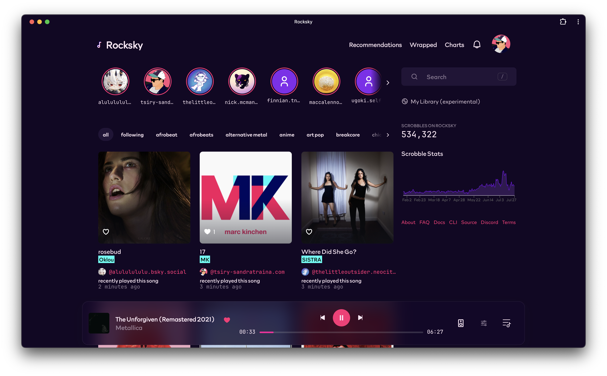

# Rocksky 

[](https://github.com/tsirysndr/rocksky/actions/workflows/ci.yml)
[](https://github.com/tsirysndr/rocksky/actions/workflows/build.yml)
[](https://discord.gg/EVcBy2fVa3)
[](https://flakehub.com/flake/tsirysndr/rocksky)

**A decentralized, open-source Last.fm alternative built on the AT Protocol (Bluesky).**

Rocksky automatically tracks ("scrobbles") the music you listen to from Spotify, Jellyfin, Navidrome, browsers, Android, and more — then publishes it to your decentralized identity. Own your listening history, see what friends are playing in real time, get rich stats, and discover new music — all without a central company controlling your data.

**[rocksky.app](https://rocksky.app)** • **[Docs](https://docs.rocksky.app)** • **[Discord](https://discord.gg/EVcBy2fVa3)**



## Contents

- [Features](#-features)
  - [Scrobbling](#-scrobbling)
  - [Your library](#-your-library)
  - [Playback](#-playback)
  - [Physical shortcuts](#-physical-shortcuts)
  - [Social & discovery](#-social--discovery)
  - [Insights](#-insights)
  - [Apps & clients](#-apps--clients)
  - [Build on it](#-build-on-it)
- [Roadmap](#-roadmap)
- [Quick Start (for users)](#quick-start-for-users)
- [Self-Hosting / Development](#-self-hosting--development)
- [Comparison](#comparison)
- [Documentation](#-documentation)
- [Feedback & Contributing](#feedback--contributing)

## ✨ Features

### 🎵 Scrobbling

- **Last.fm compatible API** — works with almost any existing Last.fm scrobbler
- **ListenBrainz compatible API** — broad client support
- **Spotify** — direct "now playing" detection
- **Jellyfin**, **Navidrome** — media server scrobbling
- **Pano Scrobbler** (Android/Linux/Windows), **WebScrobbler** (browser)
- **Rocksky Connect** — scrobble from MPD, Mopidy, VLC, Kodi, and any MPRIS player
- Automatic **Last.fm mirroring** of new scrobbles
- Import your history from Last.fm or ListenBrainz

### 📚 Your library

- **Upload your own music** and stream it back from anywhere
- **Bring your own storage** — keep the files in your own S3 bucket, or use the
  managed one
- Import from **Dropbox** and **Google Drive**
- Browse by track, album, artist, playlist or **favorites**
- **Playlists** mirrored to your AT Protocol repo, so they travel with your
  identity rather than living only on a server

### ▶️ Playback

- Plays **in the browser** — decoding and DSP run in WebAssembly, with no
  streaming server in the middle
- **Rocksky Connect** — start something on one device and control it from
  another
- Queue, shuffle, repeat, crossfade and a parametric **equalizer**
- Fullscreen player with a live scrobble timeline

### 🏷️ Physical shortcuts

Tap or insert a card and the album, playlist or your favorites starts playing.

- **NFC tags** — NTAG213/215/216, MIFARE Ultralight, and MIFARE Classic
  (formatted automatically on first write)
- **Smart cards** — SLE5528 memory cards and ACOS3 processor cards
- Tags carry the record's AT-URI, so one written on any Rocksky player works on
  every other — with the library id behind it as a fallback
- Write them from the desktop app, the CLI, or the terminal UI

### 🌐 Social & discovery

- **Stories** — see what everyone is listening to, live
- **Shouts** and **likes** on songs, albums, artists and profiles
- Follow other listeners; see who else plays what you play
- **Recommendations** precomputed from your history and audio features
- **Wrapped** — your listening year, summarised

### 📊 Insights

- Top artists, tracks and albums over any period
- Charts, listening analytics and daily/weekly visualisations
- **Explorer** — query your own listening data with RSQL
- Blazing-fast search powered by Typesense

### 💻 Apps & clients

- **Web** — [rocksky.app](https://rocksky.app), with a dedicated mobile build
- **Desktop** — native app for macOS, Linux and Windows
- **CLI** — scrobble, search, browse, upload and import from the terminal,
  including a full **TUI** player
- **MCP server** — let Claude and other assistants read your listening history

### 🔧 Build on it

- **SDKs** for TypeScript, Python, Rust, Go, Ruby, Kotlin, Elixir, Erlang,
  Clojure and Gleam
- Public **HTTP API** with an OpenAPI spec, plus AT Protocol lexicons
- **API keys** and long-lived **access tokens** for your own integrations
- **Embeddable player** for sharing what you are listening to

## 🚧 Roadmap

- Webhooks (Discord, custom integrations)
- Extensions system
- Cross-device settings sync
- More storage backends and media servers

## Quick Start (for users)

1. Go to **[rocksky.app](https://rocksky.app)** and sign in with your Bluesky account
2. Connect your music apps (Spotify, Jellyfin, etc.)
3. Start scrobbling — your data stays under your control

**Self-hosting** and advanced usage instructions are below.

## 🚀 Self-Hosting / Development

### Prerequisites
- Node.js (v22+)
- Bun
- Docker + Docker Compose
- Rust (for some crates)
- Deno, Go, Turbo, Wasm Pack (see full docs)

### Getting Started

```bash
# 1. Clone the repo
git clone https://github.com/tsirysndr/rocksky.git
cd rocksky

# 2. Install dependencies
npm install -g turbo
bun install

# 3. Environment variables
cp apps/api/.env.example apps/api/.env
cp apps/web/.env.example apps/web/.env
cp apps/feeds/.env.example apps/feeds/.env
cp .env.example .env
# Edit the .env files as needed
```

```bash
# 4. Start services
docker compose up -d

# 5. Database migrations
turbo db:migrate --filter=@rocksky/api

# 6. Spotify integration (optional but recommended)
# Set SPOTIFY_ENCRYPTION_KEY and SPOTIFY_ENCRYPTION_IV first
bun run spotify <your_client_id> <your_client_secret>
```

Then run the dev servers:

```bash
bun run dev:jetstream
bun run mb
bun run feeds
turbo dev --filter=@rocksky/api --filter=@rocksky/web
```

### Operations console (Clojure REPL)

`tools/console/` is a Clojure project that centralizes every operational script
in the monorepo — lexicon codegen, DB migrations, data sync/backfill, Rust
daemons, devops glue — behind one discoverable REPL. Instead of remembering
which `package.json` script lives in which workspace or which `cargo run -p ...`
invokes which daemon, you call functions:

```bash
cd tools/console
mise install                       # locks JDK 21, Clojure, Babashka
clj -M:rebel                       # pretty terminal REPL (try `(help)`)
clj -M:dev                         # nREPL on :7888 for CIDER / Calva / Cursive
bb help                            # or fast one-shot CLI tasks
bb sync did:plc:abc123             # e.g. sync one user's scrobbles
```

See [`tools/console/README.md`](tools/console/README.md) for the full command
catalog and design notes.

## Comparison

| Feature                 | Last.fm       | ListenBrainz     | **Rocksky**              |
|-------------------------|---------------|------------------|--------------------------|
| Open Source             | No            | Yes              | Yes                      |
| Decentralized Identity  | No            | No               | Yes (AT Protocol)        |
| Social Feed             | Limited       | Basic            | Real-time Stories        |
| Data Ownership          | Last.fm       | You (export)     | You (on your PDS)        |
| Last.fm Compatibility   | —             | Partial          | Strong                   |

## 📚 Documentation

Full documentation is available at **[docs.rocksky.app](https://docs.rocksky.app)**.

- **[Quickstart](https://docs.rocksky.app/quickstart)** – Get scrobbling in a few minutes
- **[FAQ](https://docs.rocksky.app/faq)** – Common questions answered
- **Integrations** – [Jellyfin](https://docs.rocksky.app/integrations/jellyfin), [Navidrome](https://docs.rocksky.app/integrations/navidrome), [Pano Scrobbler](https://docs.rocksky.app/integrations/pano-scrobbler), [Kodi](https://docs.rocksky.app/integrations/kodi), [Claude Desktop](https://docs.rocksky.app/integrations/claude-desktop)
- **Migrating** – [from Last.fm](https://docs.rocksky.app/migrations/from-lastfm) · [from ListenBrainz](https://docs.rocksky.app/migrations/from-listenbrainz)
- **[Rocksky CLI](https://docs.rocksky.app/cli/overview)** – Scrobble, search, and manage from the terminal
- **[SDKs](https://docs.rocksky.app/sdks/overview)** – TypeScript, Python, Rust, Go, Ruby, Kotlin, Elixir, Clojure, Gleam
- **[API reference](https://docs.rocksky.app/api-reference/introduction)** – HTTP endpoints and OpenAPI spec

## Feedback & Contributing

This repo is the central place for issues and discussions.

- Join the **[Discord](https://discord.gg/EVcBy2fVa3)**
- Open issues on [Tangled](https://tangled.org/@rocksky.app/rocksky/issues/new)
- See [CONTRIBUTING.md](CONTRIBUTING.md) for development setup

---

**Made with ❤️ for music lovers who want control over their data.**

[rocksky.app](https://rocksky.app) • [Docs](https://docs.rocksky.app)
